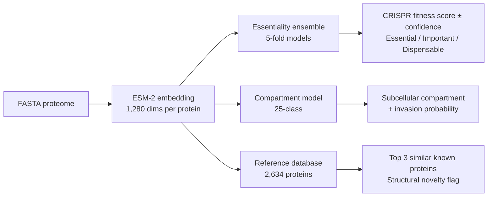

<p align="center">
  
</p>

# ApiPred

**Predict fitness phenotypes, subcellular compartments, and invasion machinery in apicomplexan proteomes from sequence alone.**

ApiPred uses ESM-2 protein language model embeddings to predict protein essentiality, subcellular localisation across 25 compartments, invasion machinery membership, and structural context for any apicomplexan species. Trained on *Toxoplasma gondii* experimental data (Sidik et al. 2016 CRISPR screen + Barylyuk et al. 2020 hyperLOPIT) and validated across *Plasmodium berghei*.

## How it works



## Performance

| Metric | Value | Note |
|--------|-------|------|
| CRISPR score prediction (Spearman rho) | **0.56** | 5-fold ensemble CV, 3,796 T. gondii proteins |
| Fitness classification (ROC AUC) | **0.77** | Essential (CRISPR < -3) vs non-essential |
| Invasion classification (ROC AUC) | **0.95** | Derived from 25-class compartment model |
| Multi-compartment accuracy | **0.57** | 25 compartments (random baseline: 0.04) |
| Cross-species fitness transfer (Spearman rho) | **0.31** | Tg-predicted scores vs Pb experimental growth rates |

### Per-compartment classification (one-vs-rest AUC)

| Compartment | AUC | n |
|-------------|-----|---|
| Rhoptries 1 | 0.980 | 57 |
| Apical 2 | 0.971 | 16 |
| Apical 1 | 0.962 | 47 |
| Micronemes | 0.954 | 51 |
| Dense granules | 0.939 | 124 |
| Rhoptries 2 | 0.906 | 49 |
| IMC | 0.901 | 81 |

Note: invasion AUC evaluated on 2,625 proteins with confident hyperLOPIT compartment assignments, excluding 1,198 proteins of unknown localisation.

## Validation

<p align="center">
  
</p>

*(A) Cross-species transfer: model trained on T. gondii CRISPR data predicts P. berghei experimental growth rates across 1,136 ortholog pairs (rho = 0.40 for actual Tg scores; rho = 0.31 for ApiPred-predicted scores). (B) Within-species 5-fold cross-validation on 3,796 T. gondii proteins (rho = 0.56). (C) Per-compartment fitness: invasion compartments (red) are dispensable in tachyzoite culture while housekeeping machinery (ribosomes, proteasome) is essential, confirming biological coherence.*

## Example output

```bash
# T. gondii proteins
python predict.py --input examples/test_tg.fasta --output predictions_tg.tsv

# P. falciparum proteins (cross-species)
python predict.py --input examples/test_pf.fasta --output predictions_pf.tsv
```

**T. gondii example:**

| Protein | Fitness | CRISPR Score | Confidence | Compartment | Invasion | Top Match |
|---------|---------|-------------|------------|-------------|----------|-----------|
| `TGME49_250340` | important | -2.61 | high | apical 2 | yes | centrin 2 |
| `TGME49_256030` | important | -1.87 | high | apical 1 | yes | DCX |
| `TGME49_226220` | important | -1.60 | high | IMC | yes | alveolin IMC9 |
| `TGME49_265790` | important | -1.33 | high | micronemes | yes | hypothetical |
| `TGME49_300100` | dispensable | -0.35 | high | rhoptries 1 | yes | RON2 |
| `TGME49_200010` | dispensable | 0.27 | high | dense granules | yes | hypothetical |

Each protein gets: predicted compartment (25-class), essentiality confidence (ensemble agreement across 5 folds), invasion probability (summed from invasion compartment scores), top 3 structurally similar characterised proteins, and a structural novelty flag.

## Installation

```bash
git clone https://github.com/jsmccabe1/ApiPred.git
cd ApiPred
pip install -r requirements.txt
```

Pre-trained models are included in `models/`. No additional downloads required.

## Quick start

```bash
# Predict with pre-trained models
python predict.py --input my_proteome.fasta --output predictions.tsv

# Use GPU (recommended for >100 proteins)
python predict.py --input my_proteome.fasta --output predictions.tsv --device cuda

# Verify installation
python predict.py --input examples/test_tg.fasta --output /tmp/test.tsv
```

## Training from scratch

To retrain models from the source T. gondii data:

```bash
python train_model.py --data-dir /path/to/Apicomplexa/
```

This requires the [Apicomplexa analysis pipeline](https://github.com/jsmccabe1) data directory containing:
- `results/embeddings/all_proteins/protein_embeddings.npy`
- `data/processed/protein_features.tsv` (includes Sidik et al. CRISPR scores)
- `data/processed/protein_compartments.tsv` (hyperLOPIT assignments)

Generates three files in `models/`:
- `essentiality_model.joblib` - CRISPR score regressor + fitness classifier
- `invasion_model.joblib` - invasion compartment classifier
- `reference_db.npz` - 2,634 characterised T. gondii proteins for structural context

## Output columns

| Column | Description |
|--------|-------------|
| `protein_id` | FASTA header ID |
| `description` | FASTA header description |
| `length` | Protein length (aa) |
| `predicted_crispr_score` | Predicted CRISPR fitness (more negative = more essential in culture) |
| `score_std` | Standard deviation across 5 ensemble folds (lower = more confident) |
| `essential_probability` | P(essential), where essential = CRISPR score < -3 |
| `essentiality_class` | `essential` / `important` / `dispensable` |
| `essentiality_confidence` | `high` (std < 0.5) / `medium` (std < 1.0) / `low` (std >= 1.0) |
| `predicted_compartment` | Most likely subcellular compartment (25-class) |
| `compartment_confidence` | Probability of predicted compartment (0-1) |
| `invasion_probability` | Sum of invasion compartment probabilities |
| `predicted_invasion` | `yes` / `no` (threshold: 0.5) |
| `similar_1_id` | Most structurally similar characterised protein |
| `similar_1_desc` | Its description |
| `similar_1_compartment` | Its subcellular compartment |
| `similar_1_similarity` | Cosine similarity (0-1) |
| `similar_1_crispr` | Its experimental CRISPR score |
| `similar_2_*`, `similar_3_*` | 2nd and 3rd most similar |
| `max_similarity_to_known` | Highest similarity to any characterised protein |
| `structural_novelty` | `novel` (sim < 0.95) or `known_fold` |

## Training data

- **Fitness labels:** Sidik et al. 2016, genome-wide CRISPR screen in T. gondii tachyzoites (3,796 proteins with scores)
- **Compartment labels:** Barylyuk et al. 2020, hyperLOPIT spatial proteomics (2,625 proteins across 25 compartments, 1,198 unknown excluded)
- **Embeddings:** ESM-2 (esm2_t33_650M_UR50D, 650M parameters, 4-layer mean: layers 20, 24, 28, 33)
- **Essentiality model:** 5-fold gradient boosting ensemble (predictions = mean across folds; confidence = std across folds)
- **Compartment model:** Random forest (500 trees, 25-class)

## Limitations

- Fitness predictions reflect tachyzoite culture conditions (Sidik et al. 2016); genes dispensable in vitro may be essential in vivo or in other life stages
- Cross-species transfer validated for P. berghei blood stages only; accuracy on more distant species (Cryptosporidium, gregarines) is untested
- ESM-2 context window is 1,022 tokens; longer proteins use sliding window mean-pooling
- Structural context is computed against the *T. gondii* reference DB only, so the `structural_novelty` flag for cross-species predictions means "novel relative to characterised Toxoplasma proteins" rather than "novel in the apicomplexan proteome"
- Invasion predictions trained on hyperLOPIT compartment labels; may be less accurate for non-Toxoplasma species
- ESM-2 was trained on UniRef50 which includes apicomplexan proteins, so the embeddings aren't fully independent of the training labels

## Citation

If you use ApiPred, please cite:

> McCabe, JS. (2026) ApiPred: subcellular proteomics prediction for Apicomplexa using protein language model embeddings. https://github.com/jsmccabe1/ApiPred

And the underlying data sources:
- Lin Z et al. (2023) Evolutionary-scale prediction of atomic-level protein structure with a language model. *Science* 379:1123-1130.
- Sidik SM et al. (2016) A genome-wide CRISPR screen in Toxoplasma identifies essential apicomplexan genes. *Cell* 167:1423-1435.
- Barylyuk K et al. (2020) A comprehensive subcellular atlas of the Toxoplasma proteome via hyperLOPIT. *Cell Host & Microbe* 28:752-766.

## License

MIT
