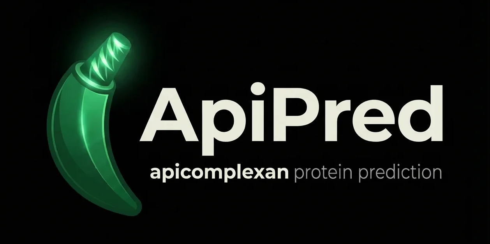
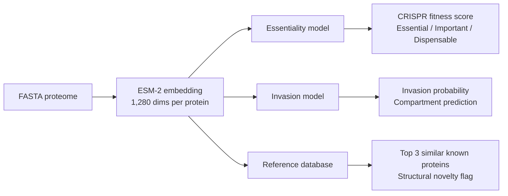

<p align="center">
  
</p>

# ApiPred

**Predict fitness phenotypes and invasion machinery in apicomplexan proteomes from sequence alone.**

ApiPred uses ESM-2 protein language model embeddings to predict protein essentiality in tachyzoite culture, invasion compartment membership, and structural context for any apicomplexan species, trained on *Toxoplasma gondii* experimental data and validated across *Plasmodium berghei*.

## How it works



## Performance

| Metric | Value | Note |
|--------|-------|------|
| CRISPR score prediction (Spearman rho) | **0.56** | 5-fold CV, 3,796 T. gondii proteins |
| Fitness classification (ROC AUC) | **0.77** | Essential (CRISPR < -3) vs non-essential |
| Invasion classification (ROC AUC) | **0.95** | 5-fold CV, 2,634 proteins with known compartments |
| Cross-species fitness transfer (Spearman rho) | **0.31** | Tg-predicted scores vs Pb experimental growth rates |

Note: the invasion AUC (0.95) is evaluated on 2,634 proteins with confident hyperLOPIT compartment assignments, excluding 1,198 proteins of unknown localisation. Including unknowns as negatives reduces AUC to 0.90.

## Validation

<p align="center">
  
</p>

*(A) Cross-species transfer: model trained on T. gondii CRISPR data predicts P. berghei experimental growth rates across 1,136 ortholog pairs (rho = 0.40 for actual Tg scores; rho = 0.31 for ApiPred-predicted scores). (B) Within-species 5-fold cross-validation on 3,796 T. gondii proteins (rho = 0.56). (C) Per-compartment fitness: invasion compartments (red) are dispensable in tachyzoite culture while housekeeping machinery (ribosomes, proteasome) is essential, confirming biological coherence.*

## Example output

```bash
# T. gondii proteins
python predict.py --input examples/test_tg.fasta --output predictions_tg.tsv

# P. falciparum proteins (cross-species)
python predict.py --input examples/test_pf.fasta --output predictions_pf.tsv
```

**T. gondii example:**

| Protein | Fitness | CRISPR Score | Invasion | Top Match | Compartment |
|---------|---------|-------------|----------|-----------|-------------|
| `TGME49_250340` | important | -2.49 | yes | centrin 2 | apical 2 |
| `TGME49_243250` | important | -2.41 | no | myosin H | apical 2 |
| `TGME49_226220` | important | -1.71 | yes | alveolin domain protein | IMC |
| `TGME49_246930` | important | -1.63 | yes | calmodulin CAM1 | apical 2 |
| `TGME49_300100` | dispensable | -0.61 | yes | RON2 | rhoptries 1 |
| `TGME49_262730` | dispensable | 0.46 | yes | ROP16 | rhoptries 1 |

Each protein also gets its top 3 structurally similar characterised proteins (with descriptions, compartments, and CRISPR scores) and a structural novelty flag.

## Installation

```bash
git clone https://github.com/jsmccabe1/apipred.git
cd apipred
pip install -r requirements.txt
```

Pre-trained models are included in `models/`. No additional downloads required.

## Quick start

```bash
# Predict with pre-trained models
python predict.py --input my_proteome.fasta --output predictions.tsv

# Use GPU (recommended for >100 proteins)
python predict.py --input my_proteome.fasta --output predictions.tsv --device cuda

# Verify installation
python predict.py --input examples/test_tg.fasta --output /tmp/test.tsv
```

## Training from scratch

To retrain models from the source T. gondii data:

```bash
python train_model.py --data-dir /path/to/Apicomplexa/
```

This requires the [Apicomplexa analysis pipeline](https://github.com/jsmccabe1) data directory containing:
- `results/embeddings/all_proteins/protein_embeddings.npy`
- `data/processed/protein_features.tsv` (includes Sidik et al. CRISPR scores)
- `data/processed/protein_compartments.tsv` (hyperLOPIT assignments)

Generates three files in `models/`:
- `essentiality_model.joblib` - CRISPR score regressor + fitness classifier
- `invasion_model.joblib` - invasion compartment classifier
- `reference_db.npz` - 2,634 characterised T. gondii proteins for structural context

## Output columns

| Column | Description |
|--------|-------------|
| `protein_id` | FASTA header ID |
| `description` | FASTA header description |
| `length` | Protein length (aa) |
| `predicted_crispr_score` | Predicted CRISPR fitness (more negative = more essential in culture) |
| `essential_probability` | P(essential), where essential = CRISPR score < -3 |
| `essentiality_class` | `essential` / `important` / `dispensable` |
| `invasion_probability` | P(invasion compartment) |
| `predicted_invasion` | `yes` / `no` |
| `similar_1_id` | Most structurally similar characterised protein |
| `similar_1_desc` | Its description |
| `similar_1_compartment` | Its subcellular compartment |
| `similar_1_similarity` | Cosine similarity (0-1) |
| `similar_1_crispr` | Its experimental CRISPR score |
| `similar_2_*`, `similar_3_*` | 2nd and 3rd most similar |
| `max_similarity_to_known` | Highest similarity to any characterised protein |
| `structural_novelty` | `novel` (sim < 0.95) or `known_fold` |

## Training data

- **Fitness labels:** Sidik et al. 2016, genome-wide CRISPR screen in T. gondii tachyzoites (3,796 proteins with scores)
- **Invasion labels:** Barylyuk et al. 2020, hyperLOPIT spatial proteomics (425 invasion, 2,209 non-invasion, 1,198 unknown excluded)
- **Embeddings:** ESM-2 (esm2_t33_650M_UR50D, 650M parameters)
- **Models:** Gradient boosting (scikit-learn), 5-fold cross-validated

## Limitations

- Fitness predictions reflect tachyzoite culture conditions (Sidik et al. 2016); genes dispensable in vitro may be essential in vivo or in other life stages
- Cross-species transfer validated for P. berghei blood stages only; accuracy on more distant species (Cryptosporidium, gregarines) is untested
- ESM-2 context window is 1,022 tokens; longer proteins use sliding window mean-pooling
- Structural context is relative to characterised T. gondii proteins; truly novel folds may not be detected
- Invasion predictions trained on hyperLOPIT compartment labels; may be less accurate for non-Toxoplasma species
- ESM-2 was trained on UniRef50 which includes apicomplexan proteins, so the embeddings aren't fully independent of the training labels

## Citation

If you use ApiPred, please cite:

> McCabe, JS. (2026) Protein language model embeddings reveal the structural logic of apicomplexan host cell invasion. *In preparation.*

And the underlying methods:
- Lin Z et al. (2023) Evolutionary-scale prediction of atomic-level protein structure with a language model. *Science* 379:1123-1130.
- Sidik SM et al. (2016) A genome-wide CRISPR screen in Toxoplasma identifies essential apicomplexan genes. *Cell* 167:1423-1435.
- Barylyuk K et al. (2020) A comprehensive subcellular atlas of the Toxoplasma proteome via hyperLOPIT. *Cell Host & Microbe* 28:752-766.

## License

MIT
