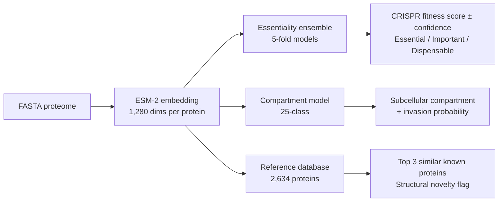

<p align="center">
  
</p>

# ApiPred

**Predict fitness phenotypes, subcellular compartments, and invasion machinery in apicomplexan proteomes from sequence alone.**

ApiPred uses ESM-2 protein language model embeddings to predict protein essentiality, subcellular localisation across 25 compartments, invasion machinery membership, and structural context for any apicomplexan species. Trained on *Toxoplasma gondii* experimental data (Sidik et al. 2016 CRISPR screen + Barylyuk et al. 2020 hyperLOPIT) and validated across *Plasmodium berghei*.

Beyond the base prediction, ApiPred supports:

- **Baseline control-proteome panel** (`--baseline-panel`). Ranks every query against a precomputed distribution of invasion scores from known apicomplexan and free-living alveolate control proteomes, and reports an empirical invasion FDR estimated from the free-living background.
- **Per-window domain scoring** (`--per-window`). Segments each protein into ~200 aa windows and scores each independently, so the output pinpoints *where in the protein* the apicomplexan-like region lives.
- **`extract.py` candidate exporter**. Filters, dedupes (TransDecoder ORF collapse), and writes a ready-to-analyse FASTA + metadata TSV + HTML evidence-card report.
- **Structural validation stub** (`--validate-structures N`). Opt-in ESMFold + Foldseek pipeline for the top N candidates.

## How it works



## Performance

| Metric | Value | Note |
|--------|-------|------|
| CRISPR score prediction (Spearman rho) | **0.56** | 5-fold ensemble CV, 3,796 T. gondii proteins |
| Fitness classification (ROC AUC) | **0.77** | Essential (CRISPR < -3) vs non-essential |
| Invasion classification (ROC AUC) | **0.95** | Derived from 25-class compartment model |
| Multi-compartment accuracy | **0.57** | 25 compartments (random baseline: 0.04) |
| Cross-species fitness transfer (Spearman rho) | **0.31** | Tg-predicted scores vs Pb experimental growth rates |

### Per-compartment classification (one-vs-rest AUC)

| Compartment | AUC | n |
|-------------|-----|---|
| Rhoptries 1 | 0.980 | 57 |
| Apical 2 | 0.971 | 16 |
| Apical 1 | 0.962 | 47 |
| Micronemes | 0.954 | 51 |
| Dense granules | 0.939 | 124 |
| Rhoptries 2 | 0.906 | 49 |
| IMC | 0.901 | 81 |

Note: invasion AUC evaluated on 2,625 proteins with confident hyperLOPIT compartment assignments, excluding 1,198 proteins of unknown localisation.

## Validation

<p align="center">
  
</p>

*(A) Cross-species transfer: model trained on T. gondii CRISPR data predicts P. berghei experimental growth rates across 1,136 ortholog pairs (rho = 0.40 for actual Tg scores; rho = 0.31 for ApiPred-predicted scores). (B) Within-species 5-fold cross-validation on 3,796 T. gondii proteins (rho = 0.56). (C) Per-compartment fitness: invasion compartments (red) are dispensable in tachyzoite culture while housekeeping machinery (ribosomes, proteasome) is essential, confirming biological coherence.*

## Example output

```bash
# T. gondii proteins
python predict.py --input examples/test_tg.fasta --output predictions_tg.tsv

# P. falciparum proteins (cross-species)
python predict.py --input examples/test_pf.fasta --output predictions_pf.tsv
```

**T. gondii example:**

| Protein | Fitness | CRISPR Score | Confidence | Compartment | Invasion | Top Match |
|---------|---------|-------------|------------|-------------|----------|-----------|
| `TGME49_250340` | important | -2.61 | high | apical 2 | yes | centrin 2 |
| `TGME49_256030` | important | -1.87 | high | apical 1 | yes | DCX |
| `TGME49_226220` | important | -1.60 | high | IMC | yes | alveolin IMC9 |
| `TGME49_265790` | important | -1.33 | high | micronemes | yes | hypothetical |
| `TGME49_300100` | dispensable | -0.35 | high | rhoptries 1 | yes | RON2 |
| `TGME49_200010` | dispensable | 0.27 | high | dense granules | yes | hypothetical |

Each protein gets: predicted compartment (25-class), essentiality confidence (ensemble agreement across 5 folds), invasion probability (summed from invasion compartment scores), top 3 structurally similar characterised proteins, and a structural novelty flag.

## Installation

```bash
git clone https://github.com/jsmccabe1/ApiPred.git
cd ApiPred
pip install -r requirements.txt
```

Pre-trained models are included in `models/`. No additional downloads required.

## Quick start

```bash
# Basic prediction
python predict.py --input my_proteome.fasta --output predictions.tsv --device cuda

# With baseline panel ranks + empirical FDR
python predict.py --input my_proteome.fasta --output predictions.tsv \
    --device cuda --baseline-panel panel/ --fdr-threshold 0.05

# Per-window domain-level scoring (for long proteins)
python predict.py --input my_proteome.fasta --output predictions.tsv \
    --device cuda --per-window

# Extract the actionable candidate set from a run
python extract.py predictions.tsv \
    --invasion-only \
    --min-apicomplexan-rank 99 \
    --max-invasion-fdr 0.05 \
    --dedup transdecoder \
    --top 50 \
    --source-fasta my_proteome.fasta \
    --output candidates/

# Verify installation with the bundled T. gondii example
python predict.py --input examples/test_tg.fasta --output /tmp/test.tsv
```

### Building the baseline panel

The panel directory is generated by running `predict.py` across a fixed set
of reference proteomes (apicomplexan positive controls plus free-living
alveolate and non-alveolate background controls) and then aggregating their
invasion-probability distributions into a single `panel.json` for fast
lookup. Edit `tools/panel_default.json` to point at the proteomes on your
system, then:

```bash
python tools/build_panel.py \
    --config tools/panel_default.json \
    --output panel/ \
    --device cuda
```

Once the panel is built, every downstream `predict.py` run can pass
`--baseline-panel panel/` to add three columns to the output:
`apicomplexan_rank`, `background_rank`, and `invasion_fdr`.

## Training from scratch

To retrain models from the source T. gondii data:

```bash
python train_model.py --data-dir /path/to/Apicomplexa/
```

This requires the [Apicomplexa analysis pipeline](https://github.com/jsmccabe1) data directory containing:
- `results/embeddings/all_proteins/protein_embeddings.npy`
- `data/processed/protein_features.tsv` (includes Sidik et al. CRISPR scores)
- `data/processed/protein_compartments.tsv` (hyperLOPIT assignments)

Generates three files in `models/`:
- `essentiality_ensemble.joblib` - 5-fold ensemble of CRISPR regressors + classifiers
- `compartment_model.joblib` - 25-class hyperLOPIT compartment classifier
- `reference_db.npz` - ~2,600 characterised T. gondii proteins for structural context

## Output columns

### Base schema (always present)

| Column | Description |
|--------|-------------|
| `protein_id` | FASTA header ID |
| `description` | FASTA header description |
| `length` | Protein length (aa) |
| `predicted_crispr_score` | Predicted CRISPR fitness (more negative = more essential in culture) |
| `score_std` | Standard deviation across 5 ensemble folds (lower = more confident) |
| `essential_probability` | P(essential), where essential = CRISPR score < -3 |
| `essentiality_class` | `essential` / `important` / `dispensable` |
| `essentiality_confidence` | `high` (std < 0.5) / `medium` (std < 1.0) / `low` (std >= 1.0) |
| `predicted_compartment` | Most likely subcellular compartment (25-class) |
| `compartment_confidence` | Probability of predicted compartment (0-1) |
| `invasion_probability` | Sum of invasion compartment probabilities |
| `predicted_invasion` | `yes` / `no` (from `invasion_probability > 0.5`, optionally also constrained by `--fdr-threshold`) |
| `similar_1_id` / `similar_1_desc` / `similar_1_compartment` / `similar_1_similarity` / `similar_1_crispr` | Top T. gondii structural match and its metadata |
| `similar_2_*`, `similar_3_*` | 2nd and 3rd most similar |
| `max_similarity_to_known` | Highest similarity to any characterised protein |
| `structural_novelty` | `novel` (sim < 0.95) or `known_fold` |
| `match_specificity` | Keyword classification of the top hit description: `parasite_specific` / `conserved` / `unknown` / `unclassified`. A cheap annotation signal, *not* a filter |

### With `--baseline-panel` (control proteome ranks)

| Column | Description |
|--------|-------------|
| `apicomplexan_rank` | Percentile of `invasion_probability` within the apicomplexan panel distribution. 100 = higher than everything in the positive-control panel. Use `>= 99` as a "behaves like the top 1% of real apicomplexan invasion proteins" filter |
| `background_rank` | Percentile within the free-living alveolate + negative-control panel. 100 = higher than anything in the background. Use `>= 95` as a "stands out against free-living baseline" filter |
| `invasion_fdr` | Empirical false discovery rate: fraction of background-panel proteins that score at least this high on invasion_probability. Use `<= 0.05` for a calibrated 5% FDR candidate set |

### With `--per-window` (domain-level scoring)

| Column | Description |
|--------|-------------|
| `best_window_score` | Highest invasion_probability across all windows of this protein |
| `best_window_start` / `best_window_end` | Residue coordinates of the best-scoring window |
| `best_window_match` / `best_window_match_id` | T. gondii reference hit for the best-scoring window |
| `n_invasion_windows` | How many windows were predicted into an invasion compartment |

A sidecar `<output>.windows.tsv` is also written, containing one row per window with compartment, invasion probability, and top T. gondii match. This is the input for per-protein heatmap plots showing where along the sequence the apicomplexan-like regions lie.

## Extracting candidate sets with `extract.py`

For any real proteome larger than a few hundred proteins, the raw ApiPred
TSV is too noisy to act on directly. `extract.py` takes a prediction file
and produces a tractable candidate set in one command:

```bash
python extract.py predictions.tsv \
    --invasion-only \
    --min-apicomplexan-rank 99 \
    --min-background-rank 95 \
    --max-invasion-fdr 0.05 \
    --dedup transdecoder \
    --top 50 \
    --source-fasta proteome.fasta \
    --taxonomy contamination_calls.tsv \
    --exclude-taxonomy ciliate metazoa \
    --output candidates/
```

Produces three outputs in `candidates/`:

- `candidates.tsv` - filtered, deduped, ranked metadata
- `candidates.fasta` - sequences for the survivors (requires `--source-fasta`)
- `candidates.report.html` - one evidence card per candidate with top hits, scores, and structural context

The `--dedup transdecoder` flag collapses TransDecoder ORF IDs to gene level (e.g., `TRINITY_DN123_c0_g1_i1.p1`, `...i1.p2`, `...i2.p1` all become one row). The `--taxonomy` option accepts a user-supplied `protein_id -> taxonomy` TSV from any external pipeline (Diamond vs `nr` + taxonomy mapping, Kraken2, etc.) and lets you drop contamination calls before export.

## Structural validation (opt-in stub)

`--validate-structures N` is an opt-in flag that runs ESMFold + Foldseek on
the top N candidates, computes pLDDT and TM-score between each candidate
and its top T. gondii structural match, and writes a `structurally_validated`
column based on a TM-score threshold of 0.5. ESMFold in default mode needs
~24 GB of GPU memory, which exceeds most workstation GPUs; install
instructions for the fair-esm[esmfold] extras and Foldseek are printed
when the flag is used. The stub exits cleanly with an install recipe if
the dependencies are not present, so the rest of the pipeline is unaffected.

## Training data

- **Fitness labels:** Sidik et al. 2016, genome-wide CRISPR screen in T. gondii tachyzoites (3,796 proteins with scores)
- **Compartment labels:** Barylyuk et al. 2020, hyperLOPIT spatial proteomics (2,625 proteins across 25 compartments, 1,198 unknown excluded)
- **Embeddings:** ESM-2 (esm2_t33_650M_UR50D, 650M parameters, 4-layer mean: layers 20, 24, 28, 33)
- **Essentiality model:** 5-fold gradient boosting ensemble (predictions = mean across folds; confidence = std across folds)
- **Compartment model:** Random forest (500 trees, 25-class)

## Limitations

- Fitness predictions reflect tachyzoite culture conditions (Sidik et al. 2016); genes dispensable in vitro may be essential in vivo or in other life stages
- Cross-species transfer validated for P. berghei blood stages only; accuracy on more distant species (Cryptosporidium, gregarines) is untested
- ESM-2 context window is 1,022 tokens; longer proteins use sliding window mean-pooling
- Structural context is computed against the *T. gondii* reference DB only, so the `structural_novelty` flag for cross-species predictions means "novel relative to characterised Toxoplasma proteins" rather than "novel in the apicomplexan proteome"
- Invasion predictions trained on hyperLOPIT compartment labels; may be less accurate for non-Toxoplasma species
- ESM-2 was trained on UniRef50 which includes apicomplexan proteins, so the embeddings aren't fully independent of the training labels

## Citation

If you use ApiPred, please cite:

> McCabe, JS. (2026) ApiPred: subcellular proteomics prediction for Apicomplexa using protein language model embeddings. https://github.com/jsmccabe1/ApiPred

And the underlying data sources:
- Lin Z et al. (2023) Evolutionary-scale prediction of atomic-level protein structure with a language model. *Science* 379:1123-1130.
- Sidik SM et al. (2016) A genome-wide CRISPR screen in Toxoplasma identifies essential apicomplexan genes. *Cell* 167:1423-1435.
- Barylyuk K et al. (2020) A comprehensive subcellular atlas of the Toxoplasma proteome via hyperLOPIT. *Cell Host & Microbe* 28:752-766.

## License

MIT
